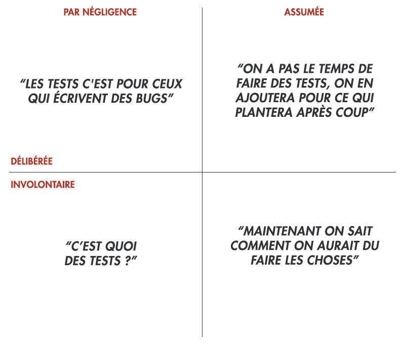

# Identifier

L'objectif de ce chapitre est de présenter ce qu'est la dette technique et en quoi elle est inévitable.

Je vous présenterai donc son histoire, ses différentes formes, et enfin comment appréhender ses impacts.

## Définition

> Le développement logiciel c’est […] combien de couches vous pouvez empiler avant qu'elles ne s'effondrent sous leur propre poids […] Il s'agit de gérer cette augmentation de la complexité.   
— Steve Jobs (<http://quotabl.es/quotes/81677>) en 1997

*TL;DR : Tout choix a des conséquences.*

En construisant un projet Web, de nombreux choix sont effectués, et ceux-ci, combinés à leurs implémentations, ont un impact sur le cycle de vie de votre projet.

Cela s’appelle la **dette technique** : l’accumulation des risques pris lors des différentes phases techniques tout au long de la vie d’un projet. 

Bien souvent, elle prend la forme d'une combinaison de fonctionnalités qui n'auraient jamais dû voir le jour (et qui sont la cause de tous les problèmes réels) avec la sédimentation naturelle du code, inéluctable (et qui peut seulement être atténuée).

Elle est inévitable. Appréhendez-la de manière à effectuer ces choix en connaissance de cause et avec honnêteté intellectuelle.

## Historique

Le terme de dette technique – selon Wikipédia (<http://fr.wikipedia.org/wiki/Dette_technique>) – provient initialement de la logique d’intérêts que l’on retrouve dans le calcul d’une dette dite financière. Il s’agit donc de son application dans la vie d’un projet de développement logiciel.

Une dette (financière ou autre) est avant tout un investissement : un emprunt est contracté auprès d'une entité, et permet la réalisation de choses impossibles sans cet apport.   
En contrepartie, le montant à rembourser est supérieur à celui qui a été emprunté, car s’y ajoutent les intérêts.   
Si elle n'est pas remboursée rapidement, son coût augmente jusqu’au point où il n'est plus possible de la rembourser intégralement et où tout nouvel emprunt ne sert qu’à rembourser les intérêts précédents, créant par là-même de nouveaux intérêts et obligations. 

Ainsi, dans l'élaboration d'un projet, des choix techniques ayant des impacts sur l’avenir du projet sont effectués. D'un côté, ils permettent au projet de débuter puis d'avancer ; d'un autre, ils grèvent les possibilités d'évolution du projet car l'accumulation de décisions et changements — qui forment ce que nous appellerons *l’historique projet* — augmente les risques d'impacts futurs, jusqu'au moment où il devient impossible de construire quoi que ce soit de solide. Les *bugs* et les effets de bord deviennent alors la normalité, empêchant toute évolution du projet. 

Dans cette situation, le remboursement des intérêts consiste à mélanger des phases de réflexion et de correction sur l'architecture technique, afin de faire le point entre l'adéquation du socle technique et l'avenir fonctionnel envisagé. Il peut alors devenir pertinent de revenir sur des choix précédents et de prendre le temps de bien préparer le socle technique avant de réattaquer une nouvelle phase de conception.

La prise de conscience de la dette technique revient donc à peser l'impact des choix effectués : évaluer le coût de résolution et le comparer au retour sur investissement.   
Tout l’enjeu est donc de réduire ce coût de résolution pour qu'il reste inférieur à ce que la dette créée rapporte **vraiment**.

## Identifier la dette technique

Force est de constater que la technicité des projets liés au Web va en grandissant de manière exponentielle, avec des problématiques qui se complexifient ou se croisent : référencement, accessibilité, réseaux sociaux, performance, multimédias et multi-écrans, API nécessaires pour des applications mobiles, diversité des plateformes mobiles, besoins d'interactivité, *cloud*, élasticité, décentralisation / centralisation / *analytics*, etc.

Ces contraintes font que notre secteur d’activité est particulièrement propice à l’expansion de la dette technique dans les projets.

Or, la différence de culture (langage, besoins, compréhension des retombées) entre les concepteurs des projets et ceux qui les réalisent entraîne, selon le rôle occupé dans un projet, des perceptions différentes pouvant varier du tout au tout. 

Pour schématiser :

* le client peut forcer pour que le projet sorte rapidement sans comprendre les enjeux techniques ;
* le développeur en sous-traitance et en retard souhaite par dessus tout en terminer avec le projet, et bâcle par conséquent les résolutions de tickets sans se soucier des effets de bord ;
* l'équipe technique reprenant le projet après un audit se demande ce qu'elle va pouvoir faire avec une telle horreur.

À l'inverse, la sur-qualité sur un projet peut également entraîner de la dette technique, en complexifiant le projet et en augmentant donc le niveau requis pour intervenir.

Pour vous aider à vous y retrouver, voici quatre types de dette technique que j’ai identifiés.

Commençons par la plus préjudiciable.

### La dette involontaire

Le manque de connaissances (technique ou métier) ainsi que la mauvaise communication au sein d’une équipe en sont les causes principales et il en résulte de mauvais choix techniques (ergonomie, algorithmie, stratégie, implémentation…).

J’ai ainsi vu des projets dont j’étais incapable de comprendre comment ils pouvaient ne serait-ce que fonctionner mais dont les développeurs et porteurs ne se plaignaient pas et où tout se passait bien. 
Le projet était à un niveau de qualité satisfaisant pour les personnes concernées.   
La prise de conscience de la dette technique a commencé dès lors que plus personne ne se satisfaisait de l’existant (renouvellement des équipes ou nouvelle volonté interne). 

Le plus souvent, les personnes qui se retrouvent dans cette situation sont noyées sous un flot quotidien de demandes – parfois contradictoires – et ne connaissent même pas le terme de ”dette technique” (situation classique d’un « junior » qui est mal encadré ou trop livré à lui-même).
Il leur est donc difficile de se projeter dans des problématiques qu'ils ne maîtrisent pas.

### La dette par négligence volontaire

Les intervenants ne cherchent pas à construire quelque chose de pérenne et ce en connaissance de cause, par négligence.   
Deux scénarios différents peuvent causer cette dette :

* les choix techniques sont effectués par désintérêt du projet, situation courante quand le seul indicateur de qualité est le nombre de tickets résolus, et non le nombre de nouveaux *bugs* créés. Cette situation ne favorise pas la qualité globale mais le fonctionnement « à la rustine ». Elle est fréquente quand les intervenants sont complètement détachés des utilisateurs finaux, comme par exemple dans les grands groupes, le secteur public ou bien quand on pratique l’*offshore* ;
* les choix techniques sont effectués non pas pour le bien du projet mais avec la seule volonté de tester quelque chose en tant qu’intervenant. Le symptôme majeur est le test ”à tout va“ des dernières ”tendances”, qui paraissent souvent amusantes les premiers jours mais qui se révèlent être assez limitées pour la construction d’un projet complet, géré en équipe.

### La dette assumée

Elle résulte d’un choix technique pris en connaissance de cause à un moment où la volonté de bien faire est contrariée par des circonstances nécessitant de devoir bâcler la qualité : « bon, là on n'a plus le temps, on doit absolument sortir le projet la semaine prochaine, donc on fait rapidement quelque chose qui marche, on nettoiera après ».

La différence avec la dette par négligence volontaire est l'intention qui la motive et le fait qu'elle est plus ou moins bien vécue.    
Ce scénario offre ainsi une chance aux intervenants de connaître leurs points faibles et de les corriger plus tard.

Les risques s’accumulent en revanche si le projet navigue de priorités en priorités et ne prend jamais le temps de nettoyer la dette après coup.

Cette dette est la plus courante et est souvent due aux délais de réalisation très courts des projets, dans un périmètre fonctionnel rarement fixé au préalable.

Voici un exemple de scénario réaliste et les questions qu’il pose tout au long du projet. Cet exemple est issu de l’article « Dette technique 101 » (<https://medium.com/@joaomilho/festina-lente-e29070811b84>) de Maiz Lulkin et traduit par Frank Taillandier sur le blog d’Occitech (<http://www.occitech.fr/blog/2014/11/intro-dette-technique/>)

@T13h37:OPENBOX

Vous commencez à écrire une application. Au début il n’y a pas besoin de rôles utilisateurs. Tout le monde peut tout faire. À un moment donné vous avez deux permissions différentes pour une action spécifique, comme par exemple un type d’utilisateur qui peut voir des rapports et les autres qui ne peuvent pas. L’équipe technique considère la possibilité de créer un système complet de permissions à part entière. Mais à ce stade, ça ressemble vraiment à quelque chose d’inutilement complexe. Une méthode dans la logique métier et une autre dans la couche de présentation feront le boulot.

Un peu plus tard, un autre cas de figure nécessite de différencier les utilisateurs, puis un autre et encore un autre. À ce stade, les développeurs réalisent que ça commence à être le chaos et que la solution est de refactoriser le code pour avoir un système décent de gestion des permissions. Cette refactorisation de code prendra plus de temps que de simplement ajouter une nouvelle méthode. Cependant, elle va simplifier le code et permettra aux futures permissions d'être simplement ajoutées par une seule ligne de code ou par une nouvelle entrée dans la base de données.

Le problème est qu’il y a vraiment un besoin commercial d’avoir les permissions actuelles en production d’ici un à deux jours, car cela permettrait à cinq clients potentiels de signer un contrat cette semaine plutôt que la semaine prochaine ou peut-être jamais, s’ils n’apprécient pas que la société n’ait pas répondu favorablement à leur seule demande.

C’est le moment où il faut décider si on contracte de la dette. Toutes les informations nécessaires à cette prise de décision sont connues. Au départ, ajouter une permission demandait 3 points de story (nda : un *point de story* est une approximation du temps relatif requis pour développer une fonctionnalité donnée). Maintenant ça en demande 4. Bientôt cela en représentera 5, 6, qui sait ? La refactorisation complète demande maintenant un effort de 21. Donc la décision, aujourd’hui n’est pas entre 4 et 21 mais entre trois scénarios possibles :

* 4 maintenant (pour la permission), 22 plus tard (la refactorisation est désormais un peu plus compliquée) et quelque chose proche de 0 pour chaque nouvelle permission après ça, accompagné par un léger gain de la productivité générale. Dans ce scénario, l’entreprise a ajouté 5 clients à son portfolio et l’argent arrive tôt;
* 21 maintenant (pour la refactorisation), 0 plus tard (pour la permission); Dans ce scénario, l’entreprise n’a pas ajouté 5 clients à son portfolio de suite, et l’argent arrivera plus tard;
* 4 maintenant (pour la permission), aucune refactorisation du tout, et donc 5 pour les prochaines permissions, puis 6, puis 7… jusqu’à ce que la refactorisation soit suggérée, avec maintenant un coût avoisinant les 50. Dans ce scénario, l’argent est encaissé tôt, mais la prochaine fois cela demandera un travail spécifique pour ajouter des clients et prendra beaucoup plus de temps.

Vu le temps total, c’est toujours mieux de partir sur la meilleure conception possible. Tout comme c’est mieux pour une entreprise d’être en mesure de faire de nouveaux investissements sans avoir besoin d’aller à la banque. Et dans ce genre d’éventualités, partir sur le premier scénario est le plus sage.
Une mise en garde cependant : même ce type de compromis ne peut pas être fait en permanence.

@T13h37:CLOSEBOX

### La dette inévitable

La quatrième forme de dette technique résulte de la sédimentation naturelle du code : tout choix impliquant des conséquences, ce qui peut paraître la meilleure option à l’instant T ne le sera peut-être plus à T+1, voire T+10, et il faudra faire avec malgré tout.

Lorsque l'âge du projet augmente, que les intervenants défilent, que les technologies évoluent… même un projet bien mené de A à Z, avec la meilleure conscience des enjeux, subira les effets de l'âge. 

J'aime y ajouter une notion supplémentaire : l'obsolescence naturelle.

Partons du postulat que pendant toute la durée du projet, vous allez apprendre des choses et vous améliorer. En regardant en arrière, vous réfléchissez à nouveau et vous vous dites : « si nous devions tout refaire maintenant, c’est comme ça que nous le ferions ».   
Il n’y a donc pas d’impact pendant la vie du projet.   
Mais un projet dont l’architecture n’est plus intéressante peut être une source de démotivation des équipes.

Sur ce projet, rembourser la dette revient donc à le rendre à nouveau intéressant pour les développeurs.

## Identifier les impacts

La dette technique a de nombreuses répercussions sur l'ensemble des acteurs concernés, qu’ils soient logiciels, humains ou organisationnels. 

Un projet écrasé par la dette technique (ou en passe de l’être) se distingue par plusieurs indicateurs :

* des développeurs qui s’écroulent, abandonnent toute idée de réussite et travaillent à la rustine ;
* des chefs de projet qui croulent sous les tickets et vivent des réunions pénibles en permanence ;
* des utilisateurs finaux qui perdent toute confiance dans l’outil, c’est-à-dire les humains derrière la technique et donc la technique elle-même ;
* un porteur de projet qui est potentiellement ruiné car il ne peut pas continuer à investir à fonds perdus à ce rythme.

Analysons plus en détails ces différents impacts. 

### Impacts techniques
Ils sont la définition même de la dette technique.   
Un projet où elle est pharaonique est sclérosé : difficulté de maintenance, *bugs* en cascades, indéterminisme.

Quand le projet ne fonctionne pas, la dette est déjà là et on ne se pose pas de question : on doit passer en cellule de crise. Cette situation est le sujet du dernier chapitre de ce livre.

Quand le projet fonctionne, on commence à se demander « Mais comment cela peut-il marcher ? ».

J’appelle couramment cet effet "tomber en marche". Il s’agit de la pire des situations : si le porteur de projet a le sentiment que le projet est en bon état, il sera quasiment impossible de le convaincre qu’il faut prendre la dette technique en considération. On doit donc "marcher sur des œufs", en essayant d'améliorer les choses sans casser ce qui tient en place.

Dans un projet non essentiel ou de faible envergure (opération ponctuelle, site complètement indépendant), les impacts techniques sont souvent faibles car cloisonnés. Il y a de fortes chances que certains aspects ne soient jamais pris en compte (ne causant pas d’impacts réels, ils sont ignorés).   

Sur un projet à petit budget, il y a généralement moins de personnes impliquées et l'objectif est de produire.   
L'effet papillon impacte le projet lui-même ainsi que les relations entre le développeur et le client, mais va rarement plus loin.

Le problème est beaucoup plus grave quand on parle d'un projet central ou pivot. Quand ce dernier donne l’illusion d’être viable et qu'il est fort probable que le site évolue un jour, on peut réellement parler de dette technique.

Une autre caractéristique de la dette technique, c’est qu’elle peut être exponentielle : si une application Web est globalement lente car la performance n’a jamais été prise en compte, un moyen *a priori* simple de l'accélérer est d'augmenter la puissance ou le nombre des serveurs… ce qui accroît la complexité de l’infrastructure d’hébergement, et donc la dette technique.

### Impacts humains
L’art de la fuite. "Trop, c’est trop". Il arrive un moment où, à force d'écoper, le manque d'intérêt et de motivation pour le projet se fait sentir, à tel point que l'abandon peut paraître la seule solution.

J’ai vu des projets où l’équipe client avait complètement démissionné de l’entreprise pour pouvoir s’affranchir d’une situation devenue invivable ; d'autres où des entreprises allaient au procès sur des projets commandités des années auparavant et où les intervenants étaient malmenés en permanence. 

#### Sur l'équipe technique
Il y a autant de types de développeurs que de développeurs (j'y inclus les intégrateurs, que l’on appelle de plus en plus souvent et à juste titre "développeurs *front*"). Chacun a sa manière d'appréhender les problèmes, d'envisager des solutions, de les faire admettre aux décideurs, et de les implémenter. 

J'ai vu beaucoup trop d'entreprises où un développeur est une personne ignorée de tous, dont le rôle s'arrête à développer les nouvelles fonctionnalités et résoudre les tickets, et qui n’est donc pas considérée comme un membre du comité décisionnel.

Ainsi, les développeurs subissent souvent au quotidien le code, les *bugs*, les quolibets issus de situations qu'ils ne maîtrisent pas ou plus. Survient alors un ras-le-bol démoralisant, quand ils commencent à sérieusement "payer" la dette technique (*bugs* sur *bugs*, tensions clients)… alors que celle-ci était prédite depuis longtemps.
La communication et les efforts en vue d’une bonne compréhension par tous sont donc essentiels pour l'ensemble des intervenants du projet.

Un mot tout de même sur les impacts de la dette technique sur le marché de l’emploi. Celui-ci est actuellement beaucoup plus favorable aux développeurs qu’aux employeurs : je connais beaucoup plus d’entreprises qui recrutent que d’entreprises qui licencient. Il est ainsi plus aisé pour un développeur de quitter une entreprise (ou un projet en perdition) et d’aller travailler ailleurs ou sur un projet plus intéressant. Ce n’est pas le cas de tous les intervenants et utilisateurs d’un projet gravement impactés par la dette technique, qui doivent vivre avec et n’ont pas vraiment d'autre choix.

#### Sur les équipes support

Ce sont les équipes support qui subissent les conséquences d’un projet infesté de *bugs* sans avoir la possibilité de résoudre les problèmes elles-mêmes.  

Il s’agit souvent de personnes de très bonne volonté et qui veulent aider, mais qui sont prises entre des utilisateurs mécontents et les priorités des développeurs, eux-mêmes souvent affectés à des sujets plus ”rentables” ou plus visibles que ce qui se passe en coulisse. C’est d’autant plus dommage qu’étant en contact avec les utilisateurs au jour le jour ils font partie de ceux qui connaissent le mieux leurs besoins.

#### Sur les équipes clients

Les projets ont souvent un agenda serré, des investisseurs et/ou des utilisateurs qui comptent dessus…

Les porteurs de projet sont les personnes qui ont rédigé et discuté les besoins avec le prestataire retenu, et qui suivront sa réalisation. C’est cette relation qui est très fortement source de dette technique, comme nous le verrons dans le chapitre suivant.

En tant que coresponsable de la dette technique, les impacts peuvent être multiples, mais aussi être assez extrêmes, allant de la mise au placard au licenciement.   
Être responsable d’un projet difficile est souvent à double tranchant.

Quant aux équipes clients qui sont utilisatrices du projet, les impacts s’apparentent alors au point précédent « équipe support ».

### Impacts organisationnels
Le projet central est sclérosé ? Les équipes découvrent des *bugs* partout et n'en peuvent plus ?   
Quelles seront les conséquences à l’échelle organisationnelle ?

Si la technique est un des éléments centraux et que rien ne marche :

- plus aucun planning ne peut être tenu ;
- on n’ose plus prendre de nouveaux marchés car les ressources sont déjà utilisées à réparer les soucis existants ;
- si de nouvelles ressources sont ajoutées, elles sont souvent mal formées et participent au projet dans le stress ;
- il n’y a aucune visibilité sur le retour à un mode fonctionnel ;
- le projet sort trop tard et « loupe le coche » ;
- les utilisateurs ne sont pas convaincus par le projet et ne l’utilisent pas ;
- les gestionnaires du projet côté client désespèrent et quittent l’entreprise.

Des sociétés engagées contractuellement à la réalisation d'un projet peuvent également finir par couler si elles ne maîtrisent pas le périmètre et la construction du projet.   
Des sociétés porteuses de projet peuvent déposer le bilan à cause de leur dette technique. 

C'est pour tâcher d'éviter ce genre de désastres que je rédige ce livre ; je vous invite donc à poursuivre vers les prochains chapitres : Prévenir et Résoudre.

